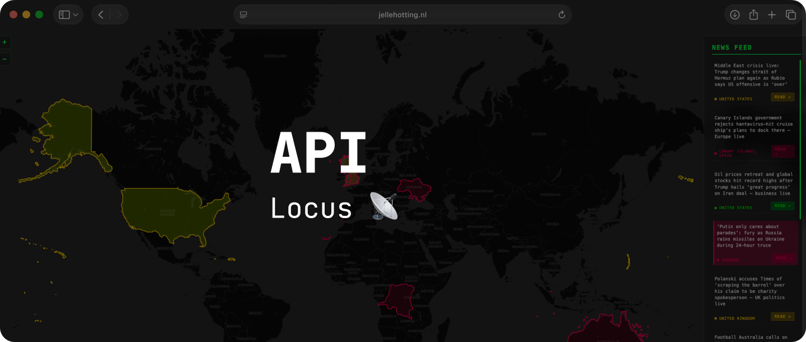
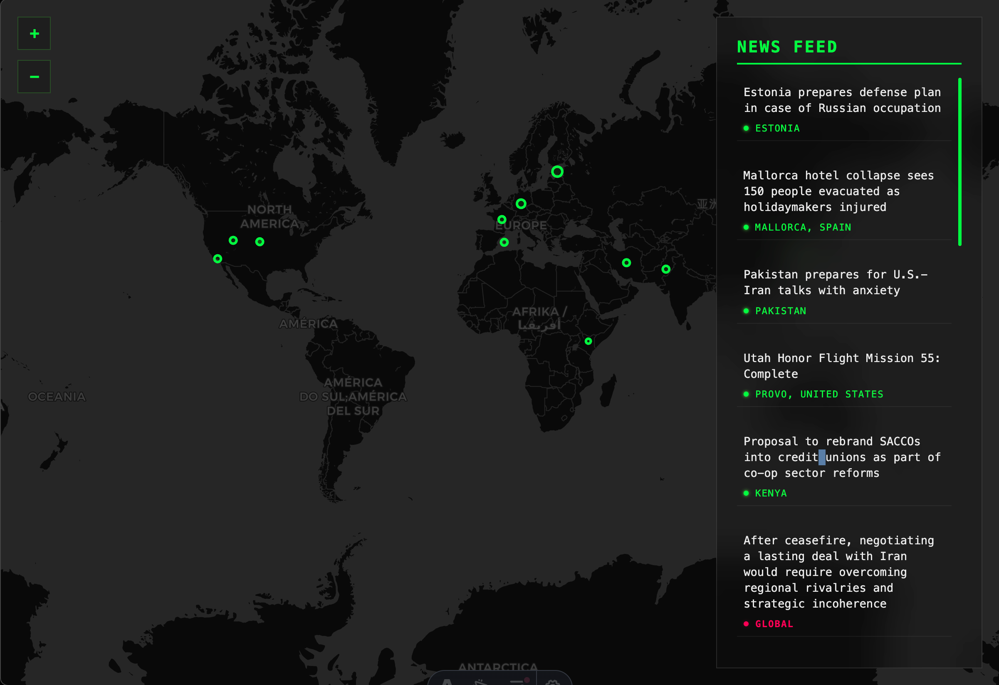
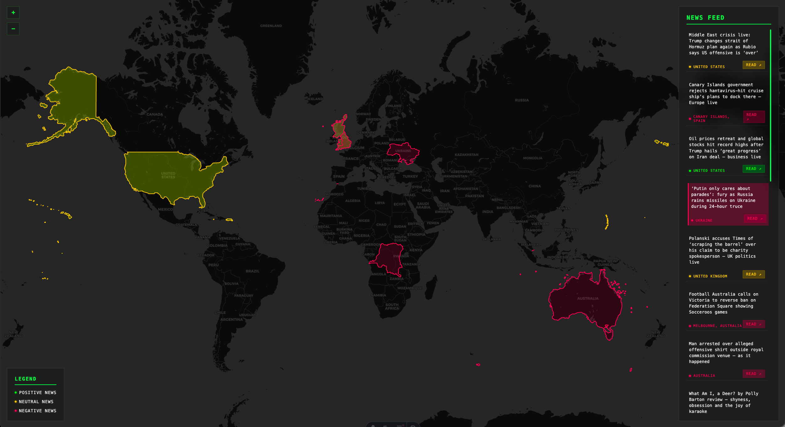

> [!WARNING]
> Dit project werkt alleen op chrome doormiddel van het lokale AI model van Chrome

## Leerdoelen bij deze opdracht

- CSS Animaties & Keyframes
  - Ik wil complexe CSS animaties en keyframes kunnen ontwerpen, zodat ik interactieve, duidelijke micro-interacties en state-changes kan bouwen.
  - _Reden: Animaties verbeteren de gebruikerservaring en maken interfaces intuïtiever._

- Responsive & Semantiek
  - Ik wil een toegankelijke en responsive interface bouwen met semantische HTML, goede contrasten en duidelijke navigatie, zodat mijn projecten bruikbaar zijn op elk device.
  - _Reden: Accessibility en responsiveness zorgen voor inclusieve, gebruiksvriendelijke websites._

## Week 1

### Dag 1

#### Wat heb ik gedaan vandaag?

| Activiteit                    | Duur  |
| ----------------------------- | ----- |
| Introductie Astro             | 2 uur |
| Brainstormen over het project | 2 uur |
| Basis gemaakt aan styling     | 1 uur |
| Map gemaakt                   | 1 uur |
| Pauze                         | 1 uur |

#### Wat heb ik geleerd?

- Hoe astro werkt
- Server side rendering

#### Wat ga ik morgen doen?

- [x] Feedback krijgen

### Week 1 recap

#### Wat heb ik deze week gedaan?

Ik heb deze week feedback gekregene op mijn idee, het is een goed idee.

#### Belangrijkste leerpunten

- APIs werken met een limiet
- Hoe je een .env file opbouwt
- Hoe ASTRO te installen

---

## Week 2

### Dag 1

#### Wat heb ik gedaan vandaag?

| Activiteit                                          | Duur    |
| --------------------------------------------------- | ------- |
| JS herstructureren (inline naar aparte bestanden)   | 1 uur   |
| Chrome AI (Gemini Nano) integratie voor locaties    | 2 uur   |
| Prompt engineering voor nauwkeurigheid & US/Global  | 1 uur   |
| Leaflet map configuratie (scrollen & visualisaties) | 1 uur   |
| API request throttling implementeren (1u interval)  | 0.5 uur |

#### Wat heb ik geleerd?

- Werken met Chrome's lokale `window.ai` voor on-device tekstverwerking.
- Hoe je Prompt engineering inzet om specifieke coördinaten uit tekst te halen.
- Leaflet map instellingen finetunen voor betere interactie (horizontal scrolling).

#### Wat ga ik morgen doen?

- [ ] De news feed visuele upgrades geven (kaartjes, animaties).

### Dag 2

#### Wat heb ik gedaan vandaag?

| Activiteit                                        | Duur    |
| ------------------------------------------------- | ------- |
| "Global" nieuws ondersteuning (AI prompt & logic) | 1.5 uur |
| World View zoom interactie geïmplementeerd        | 0.5 uur |
| CSS Refactor (Variabelen systeem voor kleuren)    | 1 uur   |
| UI/Aesthetic tuning (pink accent & white titles)  | 1 uur   |
| Testen en finetunen AI output                     | 0.5 uur |

#### Wat heb ik geleerd?

- Hoe ik CSS variabelen inzet om een dashboard makkelijk te kunnen restylen.
- Dat "Global" events op een kaart het beste werken met een de-zoom interactie (`flyTo` naar wereldniveau).
- Werken met secundaire accentkleuren (pink) voor een betere visuele hiërarchie.

#### Wat ga ik morgen doen?

- [ ] Week reflectie

### Week 2 recap

#### Wat heb ik deze week gedaan?

Locaties toegevoegd door middel van de Gemini Web AI API, en ervoor gezorgd dat de kaart soepel naar de locatie van het artikel kan scrollen.

Ik zou webworkers kunnen gebruiken om de AI sneller te laten werken

Details pagina moet ik nog over denken om het creatief te maken, misschien een emoji toevoegen op basis van hoe positief het nieuws is

#### Belangrijkste leerpunten

- **Lokale AI is krachtig, maar heeft performance-haken en ogen.** Ik heb Chrome's `window.ai` ingebouwd om locaties te extraheren. Het is geweldig dat alles on-device draait, maar zonder webworkers merk je dat de UI even hapert bij zware verwerking. 
- **Prompt engineering kost meer tijd dan code schrijven.** Om consistente steden en landen uit een stuk tekst te trekken, was ik meer bezig met het stoeien met de prompt dan met de daadwerkelijke Nominatim API call.
- **CSS variabelen voorkomen styling-chaos.** Door de kleuren (waaronder het nieuwe roze accent) centraal in CSS variabelen op te slaan, trok ik de visuele hiërarchie van het hele dashboard in no-time recht, zonder elk los component af te hoeven speuren.
- **Interactie moet vooral logisch voelen.** Voor "Global" nieuwsartikelen (die geen specifieke stad hebben) was de beste oplossing simpel: de kaart uitzoomen (`flyTo` naar wereldniveau). Geen complexe hacks, gewoon een intuïtieve transitie.

---

## Week 4

### Dag 1

#### Wat heb ik gedaan vandaag?

| Activiteit                    | Duur  |
| ----------------------------- | ----- |
| Overlay toegevoegd aan detail | 4 uur |
| Sentiment toegevoegd dmv ai   | 2 uur |

#### Wat heb ik geleerd?

- Hoe je viewtransition gebruikt serverside

#### Wat ga ik morgen doen?

- [ ] Bugfixes en kleine optimalisaties

### Dag 2

#### Wat heb ik gedaan vandaag?

| Activiteit                                   | Duur  |
| -------------------------------------------- | ----- |
| Viewtransition toegevoegd naar detail pagina | 4 uur |
| Legenda toegevoegd                           | 2 uur |

#### Wat heb ik geleerd?

- Hoe je viewtransition gebruikt serverside

#### Wat ga ik morgen doen?

- [ ] Reflectie

### Eindreflectie

Het bouwen van dit project was een stevige oefening in het samenbrengen van losse APIs en asynchrone data. De Guardian API haalt het nieuws binnen, Nominatim zorgt voor de coördinaten en Chrome's lokale AI-model (`window.ai`) koppelt die twee door tekst te analyseren. Klinkt op papier als een strak plan, maar in de praktijk stuit je op flink wat hobbels.

Wat ging soepel? De setup met Astro en de UI opbouwen voelde, zeker na de refactor naar CSS variabelen, super efficiënt. Ook View Transitions server-side werkend krijgen was even uitzoeken, maar gaf het dashboard direct een premium gevoel zonder zware frameworks.

Wat was moeilijk? De onvoorspelbaarheid van AI en limieten van de geo-API. Je kunt je prompt honderd keer finetunen, maar de AI pakt toch soms een verkeerde stad uit een tekst. Verder was throttling essentieel om de Nominatim API niet te spammen met map-requests. Uiteindelijk leer je dat het vooral draait om robuuste fallbacks schrijven en de UI niet laten crashen als een API weigert.

---

## Bronnen en AI-verantwoording

### Externe bronnen

- **The Guardian Open Platform:** Gebruikt voor het ophalen van de nieuwsartikelen. (https://openplatform.theguardian.com/)
- **Leaflet JS:** Gebruikt voor het renderen en navigeren van de wereldkaart. (https://leafletjs.com/)
- **Nominatim OpenStreetMap:** Gebruikt voor de geocoding van steden naar coördinaten. (https://nominatim.org/)

### AI-gebruik en Code Bronnen (APA)

- **Antigravity (Google DeepMind):** Heeft geholpen bij de architectuur, het refactoren van de codebase naar aparte modules, en het oplossen van Leaflet visualisatie problemen.

Hieronder staan de specifieke moeilijke code stukken die samen met de AI zijn geschreven, inclusief de prompt:

**1. Chrome AI System Prompt (`src/scripts/ai.js`)**
- **Bron:** Google DeepMind. (2026). *Antigravity* [Large language model]. https://deepmind.google/
- **Prompt:** *"Kan je een system prompt schrijven voor de lokale Chrome AI die nieuws headlines analyseert en altijd een strict JSON object teruggeeft met country, city en sentiment?"*

**2. Nominatim OpenStreetMap API Fetch (`src/scripts/ai.js`)**
- **Bron:** Google DeepMind. (2026). *Antigravity* [Large language model]. https://deepmind.google/
- **Prompt:** *"Hoe kan ik in JavaScript veilig coördinaten en geojson polygonen ophalen voor een stad en land combinatie via de Nominatim OpenStreetMap API?"*
