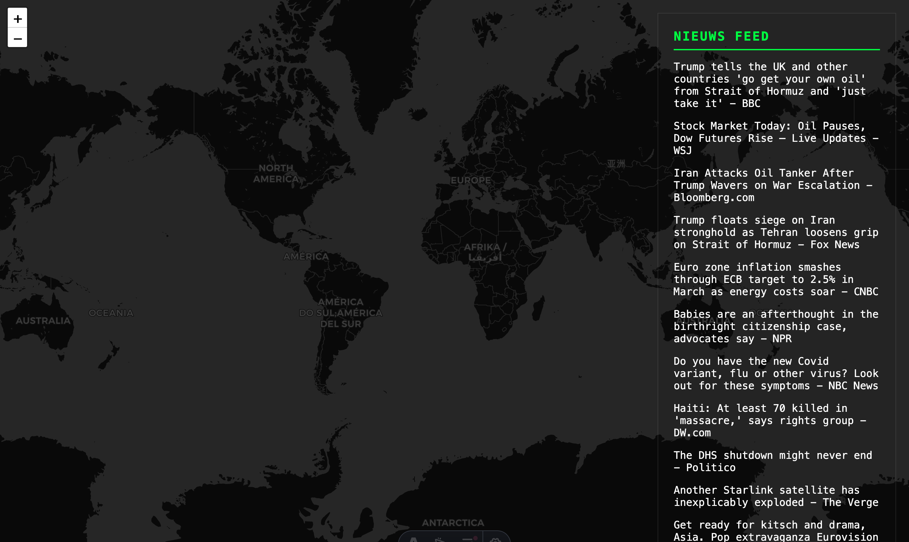

> [!WARNING]
> Dit project werkt alleen op chrome doormiddel van het lokale AI model van Chrome

## Leerdoelen bij deze opdracht

- [Leerdoel 1]
    - [Beschrijving van wat je wilt leren en bouwen]
    - *Reden: [Waarom is dit belangrijk voor je ontwikkeling?]*

- [Leerdoel 2]
    - [Beschrijving van wat je wilt leren en bouwen]
    - *Reden: [Waarom is dit belangrijk voor je ontwikkeling?]*

## Week 1

### Dag 1

#### Wat heb ik gedaan vandaag?

| Activiteit | Duur |
|------------|------|
| Introductie Astro | 2 uur |
| Brainstormen over het project | 2 uur |
| Basis gemaakt aan styling | 1 uur |
| Map gemaakt| 1 uur |
| Pauze | 1 uur |

#### Wat heb ik geleerd?

* Hoe astro werkt
* Server side rendering

#### Wat ga ik morgen doen?
- [x] Feedback krijgen

### Week 1 recap

#### Wat heb ik deze week gedaan?
Ik heb deze week feedback gekregene op mijn idee, het is een goed idee.

#### Belangrijkste leerpunten
* APIs werken met een limiet
* Hoe je een .env file opbouwt
* Hoe ASTRO te installen

---

## Week 2

### Dag 1

#### Wat heb ik gedaan vandaag?

| Activiteit | Duur |
|------------|------|
| JS herstructureren (inline naar aparte bestanden) | 1 uur |
| Chrome AI (Gemini Nano) integratie voor locaties | 2 uur |
| Prompt engineering voor nauwkeurigheid & US/Global | 1 uur |
| Leaflet map configuratie (scrollen & visualisaties) | 1 uur |
| API request throttling implementeren (1u interval) | 0.5 uur |

#### Wat heb ik geleerd?

* Werken met Chrome's lokale `window.ai` voor on-device tekstverwerking.
* Hoe je Prompt engineering inzet om specifieke coördinaten uit tekst te halen.
* Leaflet map instellingen finetunen voor betere interactie (horizontal scrolling).

#### Wat ga ik morgen doen?
- [ ] De news feed visuele upgrades geven (kaartjes, animaties).

### Dag 2

#### Wat heb ik geleerd?

* [Leerpunt]

### Week 2 recap

#### Wat heb ik deze week gedaan?
[Korte samenvatting van de week]

#### Belangrijkste leerpunten
* [Punt]

---

## Week 3 

### Dag 1

| Activiteit | Duur |
|------------|------|
| [Activiteit] | [Tijd] |

#### Wat heb ik geleerd?

* [Leerpunt]

#### Wat ga ik morgen doen?
- [ ] [Plan]

### Dag 2

| Activiteit | Duur |
|------------|------|
| [Activiteit] | [Tijd] |

#### Wat heb ik geleerd?

* [Leerpunt]

#### Wat ga ik morgen doen?
- [ ] [Plan]

### Week 3 recap

#### Belangrijkste leerpunten
* [Punt]

---

## Week 4 

### Dag 1

| Activiteit | Duur |
|------------|------|
| [Activiteit] | [Tijd] |

### Eindreflectie

[Hier komt je eindreflectie. Wat heb je geleerd? Wat ging soepel? Wat was moeilijk?]

[Afbeelding van het eindresultaat]

---

## Bronnen en AI-verantwoording

### Externe bronnen
- [Bron 1]
- [Bron 2]

### AI-gebruik
- Antigravity (Google DeepMind)

### Verantwoording AI-gebruik

- **Antigravity (Google DeepMind):** Heeft geholpen bij de architectuur, het refactoren van de codebase naar aparte modules, en het oplossen van Leaflet visualisatie problemen.